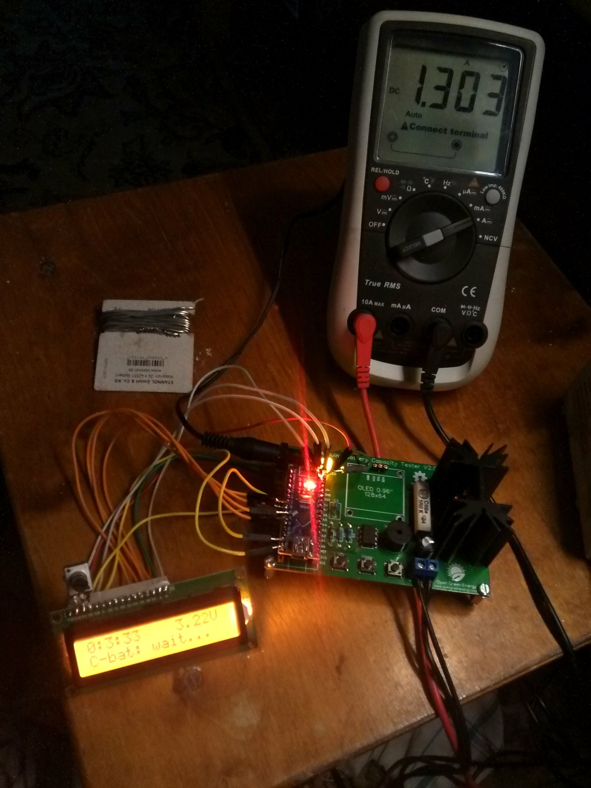

Arduino Battery Capacity Tester 3.0
===================================

Adapted from Hesham Moshiri's code.
[https://www.pcbway.com/blog/technology/Battery_capacity_measurement_using_Arduino.html](https://www.pcbway.com/blog/technology/Battery_capacity_measurement_using_Arduino.html)

Modified by Debasish Dutta (deba168)
[https://www.opengreenenergy.com/post/arduino-battery-capacity-tester-v2-0](https://www.opengreenenergy.com/post/arduino-battery-capacity-tester-v2-0) 

Cleaned up, back-ported to 1602 displays, and further modified by J. R. Schmid (sixtyfive)
[https://github.com/sixtyfive/arduino-battery-capacity-tester-3.0](https://github.com/sixtyfive/arduino-battery-capacity-tester-3.0)

To the best of my knowledge the original idea for the hardware, and the very first
sketch, came from Adam Welch, who had used a Nokia LCD and some protoboard for it.
[http://static.adamwelch.co.uk/2016/01/lithium-ion-18650-battery-capacity-checker/](http://static.adamwelch.co.uk/2016/01/lithium-ion-18650-battery-capacity-checker/)

## Features

- cleaned-up UI, including zero-padded minutes and seconds in the top-left corner running time display
- cleaned-up code, including `#define`s for where it makes sense and some comments
- a little spinner in the lower left corner while the measurement is running
- reasonably pleasant/sensible buzzer sounds for boot-up, button presses, "measurement start" and "measurement finished"
- no-battery-attached error message and buzzer sound

## How to use?

This sketch can be used with either the Arduino IDE (just open the `.ino` file inside of the `CapacityTester` folder – but you'll have to read the `#include` statements and install libraries manually) or with PlatformIO (clone this repository, then execute `pio run -t upload` with the Arduino Nano connected to the computer via USB; libraries will be downloaded and installed for you).

## Heads-up!

I'm currently using the PCB designed by Hesham Moshiri, but with a generic 1602 LCD improvised onto the Arduino Nano. Once I receive the OLED display he used, I might update this repository to use that again, or not.
